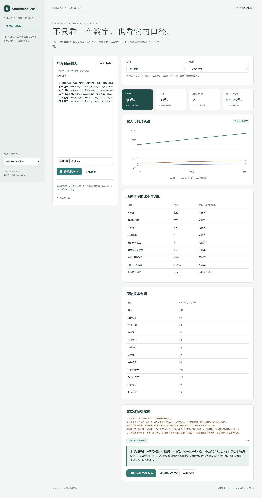

# Statement Lens

导入年度公司财务数据，核对收入增长、盈利能力、流动性与杠杆，把缺失项和异常口径一并呈现。

- 自然年全年报表，最多10家公司分开查看
- 8项财务比率与连续年度收入增长
- 公司与年度切换、原值和缺失原因核对
- 利润轨迹、资产恒等式检查及报告导出



## 快速开始

需要 Node.js 24 或更新版本；无第三方运行依赖，无需 npm install。

```sh
git clone https://github.com/Yiwen-Yang-BA/chatgpt-statement-lens.git
cd chatgpt-statement-lens
npm start
```

打开 http://127.0.0.1:3210 。默认进入**本地分析模式**，不调用 API；统计值由本地代码计算。示例数据为人工构造，界面明确标注。

### 接入真实模型

复制 `.env.example` 为 `.env`，填写 `OPENAI_API_KEY`，按账号权限设置 `OPENAI_MODEL`，然后重启服务并切换界面中的「AI 解读」。`OPENAI_BASE_URL` 必须支持 OpenAI Responses API；仅兼容 Chat Completions 的服务不适用。密钥只在服务端读取，不写入前端或仓库。

```sh
# Docker（可选；必须显式传入配置）
docker build -t chatgpt-statement-lens .
docker run --rm -p 127.0.0.1:3210:3210 --env-file .env chatgpt-statement-lens
```

## 使用方法

1. 使用模板的16列表头导入 CSV，company/year/currency/unit 必填；unit 为 ones/thousands/millions。
2. 只输入自然年1月1日至12月31日的完整年度数据，季度、TTM和非自然财年不适用。
3. 同一公司所有年份使用相同币种、单位及利润权益归属口径；缺失金额留空，不写0代替。
4. 运行后切换公司与年度查看比率、计算原因及原始金额，导出完整报告。

## 计算口径

毛利率=(收入−销货成本)/收入；营业利润率=营业利润/收入；净利率=净利润/收入。流动比率=流动资产/流动负债。总负债/权益与有息债务/权益分别计算，不能混为一个 debt ratio。ROA=净利润/平均总资产；ROE=净利润/平均权益，平均值需同一年度的期初与期末数据；未提供期初则不以期末替代。有息债务需自行采用一致范围，包括租赁时避免和借款重复；利润及权益归属须一致，不拆优先股或少数股东。分母非正、字段缺失或数值溢出时指标为空并附原因；亏损在有效分母下保留负比率。收入增长仅对连续两年、上年收入>0计算。每家公司内币种单位必须一致，不自动换算。资产=负债+权益检查使用1e-6×max(1,各余额绝对值)容差，仅提示不改原值；年度期初与上期期末不一致提示核对重述。输入金额绝对值不超过1e15，年份1900–2100。参考 [SEC财报指南](https://www.sec.gov/about/reports-publications/beginners-guide-financial-statements) 和 [OpenStax财务分析教材](https://openstax.org/books/principles-financial-accounting/pages/a-financial-statement-analysis)。

## 验证

```sh
npm run check
npm test
```

测试覆盖业务规则以及本地 HTTP 服务、模拟模型接口、输入校验和错误处理。真实付费模型调用需要用户配置有效密钥，未将本地分析测试作为真实模型质量验证。GitHub Actions 在每次推送时运行检查。

## 参考与复刻范围

灵感来自 [openbq-org/OpenBB](https://github.com/openbq-org/OpenBB)（Apache-2.0）。查询快照：2026-10-04；73,802 stars；最近推送 2026-10-02。这是当前星标量与更新状态，**不是近一个月新增星标排名**。

本仓库是对其核心交互和用途的独立轻量实现，未复制上游源码、商标或静态资源，不声称实现上游的全部功能，也不属于上游官方产品。

独立复刻财务比率分析工作台，使用示例或导入的公司财务数据，计算收入增长、利润率、流动比率、负债与权益等有明确口径的指标并作跨期比较。说明缺失项和零分母，不自动补造数据，不接付费数据商，不提供股票估值结论、推荐交易或复刻商业 OpenBB Workspace。 本版本进一步限定为自然年全年报表；公司间不跨币种或单位加总。

## 模型接收的数据

模型只接收公司名称、币种/单位、年份、已经计算的比率、增长率和缺失原因，不发送原始报表金额。

## 数据与部署边界

输入和结果仅在当前页面使用，不获取实时行情、证券估值或付费财务数据。 本地分析数据不离开本机；AI 解读仅发送本项目 README 说明的统计摘要到所配置的模型服务。

默认只监听 127.0.0.1，适用于单人本地使用；没有多用户登录或持久数据库。如需公网部署，请先增加身份验证、配额和 HTTPS。服务限制请求大小、并发和超时，禁止从静态目录读取密钥文件。

接口实现依据 [OpenAI 官方文本生成文档](https://developers.openai.com/api/docs/guides/text)。

## License

MIT — independent implementation.
